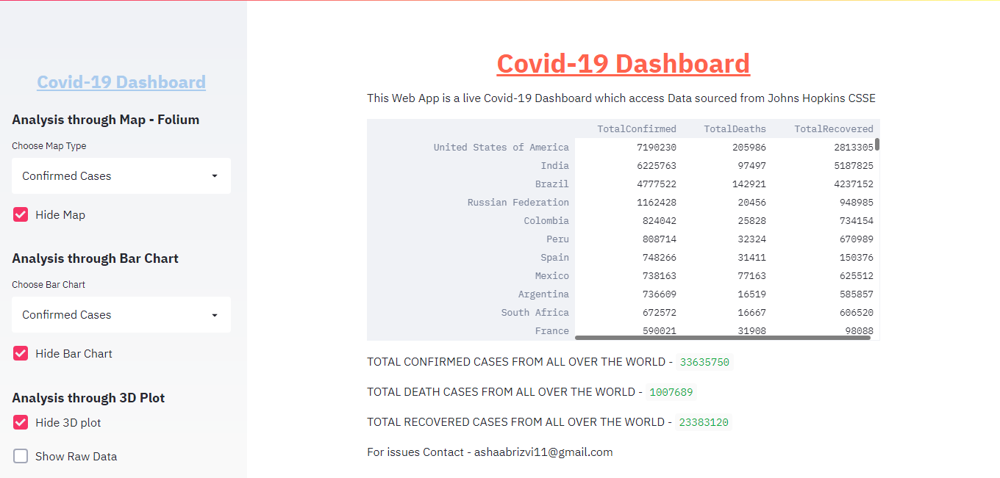
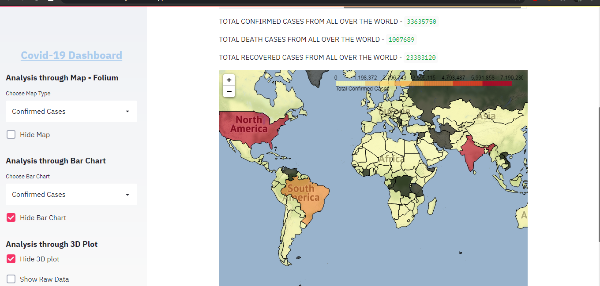
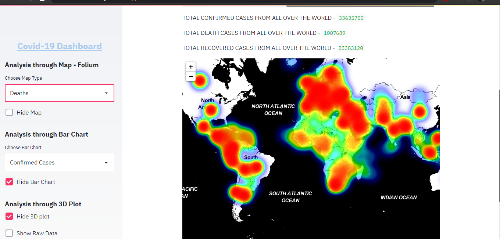
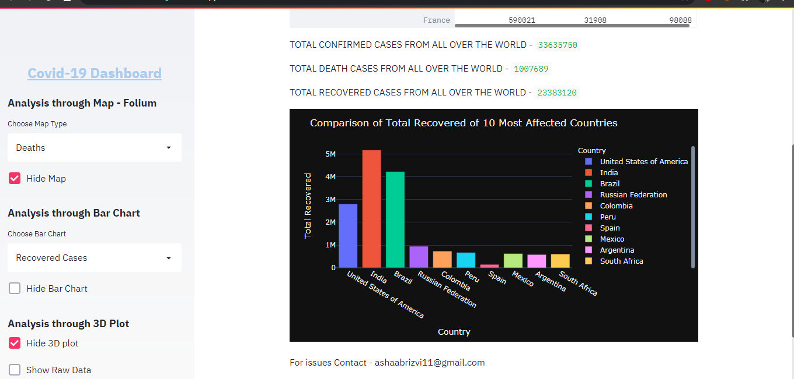

# Covid-19 Dashboard

Have a look at it -

Deployed on AWS EC2 Instance - https://bit.ly/3daFHeo (Due to fix number of hours in AWS EC2 Free tier it has been stopped for the month)

Deployed on Streamlit Share - https://share.streamlit.io/ashaabrizvi/covid-19_dashboard/covid19.py (Working Fine)

This Web App is a live Covid-19 Dashboard which access Data sourced from Johns Hopkins CSSE.

First Click the Hide option to display the respected plot.

It has Choropleth map made using Folium for Confirmed and Recovered Cases and Heatmap for Death Cases.

Also, There is a comparison of Confirmed Cases, Recovered Cases, Deaths of 10 Most Affected Countries with Bar Chart using Plotly.

At last, There is a 3D Plot of 10 Most Affected Countries.

You can also look at the Raw Data by clicking Show Raw Data.

Here are some screenshots from the app.

